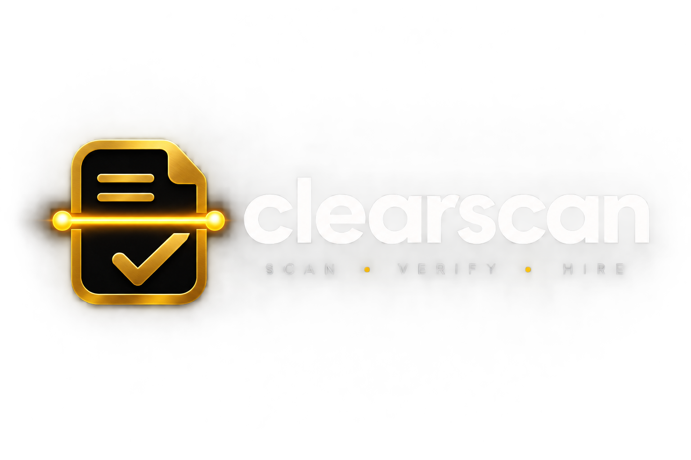

<div align="center">
  
  <h1>Clearscan</h1>
  <p><strong>Beat the ATS. Land the Job.</strong></p>
  <p>The only CV builder engineered to bypass Applicant Tracking Systems with real-time scoring, intelligent keyword matching, and recruiter-ready PDF exports.</p>
</div>

---

## 🚀 Overview

**Clearscan** is a modern, privacy-first, client-side web application designed to help job seekers build resumes that successfully pass through Applicant Tracking Systems (ATS). 

Built with React, Vite, and Tailwind CSS, Clearscan provides a seamless experience for crafting professional CVs, analyzing them against target job descriptions, and exporting them in guaranteed ATS-friendly formats—all without requiring an account or sending your personal data to a remote server.

## ✨ Features

- **🛡️ 100% Privacy-Focused**: Your data never leaves your browser. All state is managed locally via `zustand` and persisted in `localStorage`.
- **🎯 Real-Time ATS Scoring**: Paste a target Job Description (JD) and get instant feedback on keyword matching, action verb usage, and section completeness.
- **⚡ Live Preview**: See your CV update in real-time as you type, with an accurate representation of the final exported document.
- **📄 Multi-Format Export**: Export your resume in ATS-safe PDF (via `@react-pdf/renderer`), DOCX (via `docx`), or plain TXT formats.
- **🎨 Modern "Obsidian & Brass" UI**: A premium dark-mode aesthetic featuring fluid animations (`framer-motion`), crisp typography (Geist & Plus Jakarta Sans), and beautifully structured bento-grid layouts.
- **📱 Fully Responsive**: Build your resume on the go with a mobile-optimized interface featuring a bottom tab bar and adaptive split-pane builder views.

## 🛠️ Tech Stack

- **Framework**: React 19 + Vite
- **Styling**: Tailwind CSS v4 + Vanilla CSS Variables (`index.css`)
- **State Management**: Zustand
- **Form Handling & Validation**: React Hook Form + Zod
- **Icons**: Lucide React
- **Animations**: Framer Motion
- **Document Generation**: `@react-pdf/renderer` (PDF), `docx` (Word)
- **Routing**: React Router v7

## 📦 Installation & Setup

1. **Clone the repository:**
   ```bash
   git clone https://github.com/yourusername/clearscan.git
   cd clearscan
   ```

2. **Install dependencies:**
   ```bash
   npm install
   ```

3. **Start the development server:**
   ```bash
   npm run dev
   ```
   The application will be available at `http://localhost:5173`.

4. **Build for production:**
   ```bash
   npm run build
   ```

## 🧠 How ATS Scoring Works

Clearscan's ATS scoring engine (`src/lib/atsScoring.js`) evaluates your CV out of 100 points based on three core pillars:

1. **Structure & Completeness (30 pts)**: Ensures all critical sections (Contact, Experience, Education, Skills) are present and properly formatted.
2. **Action Verbs & Impact (30 pts)**: Scans your experience bullets for strong, industry-standard action verbs (e.g., *Led*, *Developed*, *Optimized*) and quantifiable metrics (numbers, percentages).
3. **Keyword Match (40 pts)**: Analyzes your target Job Description, extracts key noun phrases and technical terms, and cross-references them against your CV's skills and experience sections.

## 📁 Project Structure

```text
clearscan/
├── public/                 # Static assets (Favicons, OpenGraph banners, Logos)
├── src/
│   ├── components/
│   │   ├── ats/            # ATS Scoring UI components
│   │   ├── builder/        # Resume form sections (Experience, Education, etc.)
│   │   ├── layout/         # AppShell, Sidebar, Topbar
│   │   └── ui/             # Reusable base components (Buttons, Inputs, Toasts)
│   ├── lib/                # Core logic, ATS scoring algorithm, schemas, PDF/DOCX generators
│   ├── pages/              # Main route views (Dashboard, Builder, AtsScore, etc.)
│   ├── providers/          # React Context providers (ToastProvider)
│   ├── store/              # Zustand global state (cvStore.js)
│   ├── App.jsx             # Route definitions
│   └── index.css           # Global CSS variables and styling tokens
├── index.html              # Entry HTML
├── package.json            # Project dependencies
└── tailwind.config.js      # Tailwind configuration
```

## 🤝 Contributing

Contributions, issues, and feature requests are welcome! Feel free to check the issues page if you want to contribute.

## 📝 License

This project is licensed under the MIT License.
